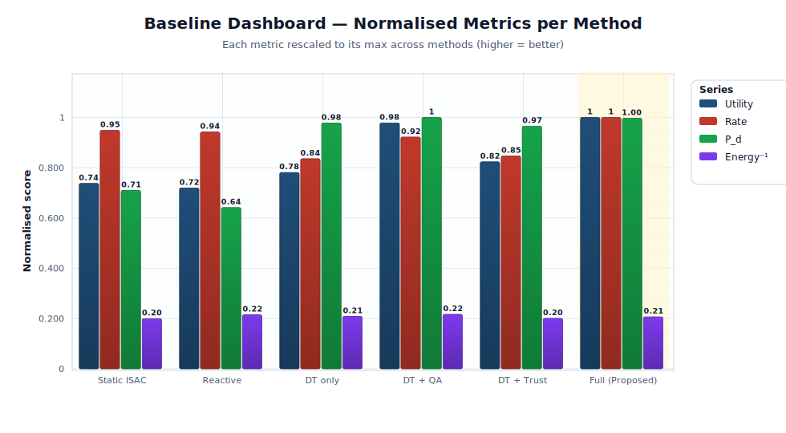

<div align="center">

# Trust-Aware Quantum-Assisted Digital-Twin Control<br/>for Secure ISAC in 6G Open-RAN

**Reference simulator and experiment artefacts**

[](https://www.python.org/)
[](https://numpy.org)
[](https://scipy.org)
[](https://matplotlib.org)
[](LICENSE)
[](#citation)
[](docs/REPRODUCIBILITY.md)

</div>

> **Paper.** *Trust-Aware Quantum-Assisted Digital Twin Control for Secure and Adaptive ISAC in 6G Open RAN.* Yassir Ameen Ahmed Al-Karawi — submitted to the **IEEE Journal on Selected Areas in Communications (JSAC)**, 2026.

This repository contains the discrete-time simulator that produces the
committed JSON artefacts in [`results/`](results) and the data-driven figures
in [`figures/`](figures). A single `master_seed` makes every **seeded
scientific metric** (utility, rate, P_d, trust, ε_DT, energy) bit-identical on
reruns with the same NumPy version. Wall-clock latency fields vary by
machine.

> **Known alignment status.** This repo went through a paper ↔ code
> consistency pass documented in
> [`docs/PAPER_CODE_ALIGNMENT_AUDIT.md`](docs/PAPER_CODE_ALIGNMENT_AUDIT.md)
> and [`docs/FINAL_ALIGNMENT_STATUS.md`](docs/FINAL_ALIGNMENT_STATUS.md).
> Read those two files for the exact snapshot the repository now matches,
> the baseline set it uses, the trust and latency semantics, and which
> claims were downgraded from earlier drafts.

---

## Table of contents
1. [Highlights](#highlights)
2. [System architecture](#system-architecture)
3. [Quick start](#quick-start)
4. [Experimental results](#experimental-results)
5. [Trust and latency semantics](#trust-and-latency-semantics)
6. [Repository layout](#repository-layout)
7. [Mapping results ↔ paper](#mapping-results--paper)
8. [Reproducibility](#reproducibility)
9. [Regenerating the figures](#regenerating-the-figures)
10. [Citation](#citation)
11. [License & acknowledgements](#license--acknowledgements)

---

## Highlights

| Area | What this simulator delivers |
|---|---|
| **Physical layer** | Rician AR(1) fading, log-normal shadowing, 8×8 UPA, mmWave 28 GHz, coordinated JT-RZF over 256 antennas |
| **Sensing** | Swerling-I detection, 512-pulse coherent integration, CRLB accuracy, dedicated 400 MHz waveform |
| **Digital twin** | Kalman-like filter with configurable synchronisation delay; fidelity metric |
| **Trust process** | Bayesian-EWMA with bounded log-likelihood; `T_safe = 0.30` is a gate threshold, not a cap on `T(t)` |
| **Candidate screener** | **Classical deterministic surrogate of variational quantum-style scoring**; `M = 50 → M_s = 12` (76 % structural reduction in full-utility evaluations) |
| **Security** | Poisson-onset / geometric-duration jamming, spoofing, mixed attacks |
| **Operations** | Near-RT 10 ms control loop; simulator wall-clock and projected native budgets are kept separate in the JSON schema |

**Headline numbers (from [`results/baseline_v2.json`](results/baseline_v2.json)
and [`results/anomaly_sweep_v2.json`](results/anomaly_sweep_v2.json)):**

- Nominal conditions: Full = **0.622**, strongest baseline (DT + QA) = **0.608** ⇒ **+2.3 %** relative utility.
- 6 % anomaly regime: Full = **0.597** vs **Static = 0.492** ⇒ **+21.5 %** relative utility. Against the strongest baseline at the same point (DT + QA = 0.587) the gain is **+1.7 %**.
- Trust recovery: after a 100-slot attack burst the Full trace bottoms at `T ≈ 0.06` and the 10–90 % recovery completes in **21 slots**.

> The **classical deterministic surrogate of VQC scoring** in `src/screening.py` is classically simulable by construction — no quantum hardware is invoked, simulated, or required.

---

## System architecture

<p align="center">
  
</p>

The closed-loop control stack runs once per 10 ms slot. Physical measurements
enter a **digital twin** which is continuously corrupted by an **anomaly
injector**; a **trust process** accumulates Bayesian evidence; a
**classical VQC-style screener** shortlists candidate actions; and a
**trust-aware gate** blends the optimiser output with a safe fallback before
deploying it to the base stations.

<p align="center">
  
</p>

> **Note on the timing figure.** The 31 ms and 1.8 ms numbers in the
> runtime-budget bar are **projected engineering budgets**, not outputs of
> this simulator. Actual per-method simulator wall-clock is in
> `results/baseline.json` under `simulator_wall_clock_ms_mean`.

<p align="center">
  
</p>

The gate guarantees monotone safety:
```
T(t) ≥ T_safe  →  a*(t) = T(t)·a_optimal + (1 − T(t))·a_safe
T(t) <  T_safe  →  a*(t) = a_safe   (hard fallback ≡ Static ISAC)
```

<p align="center">
  
</p>

---

## Quick start

```bash
# 1. Clone
git clone https://github.com/YassirALKarawi/trust-aware-isac-sim.git
cd trust-aware-isac-sim

# 2. Install (Python 3.10+)
pip install -r requirements.txt

# 3. 30-second smoke test
python src/controller.py

# 4. Reproduce the baseline comparison (~3 minutes, writes results/baseline.json)
python src/run_baseline.py

# 5. Full experiment suite (~30 minutes, writes every JSON in results/)
python src/run_all.py

# 6. Rebuild every figure from the JSON results
python tools/make_figures.py         # publication-grade PNG + PDF (matplotlib)
python tools/build_figures.py        # stdlib-only SVG fallback (no deps)
```

---

## Experimental results

> All plots below are committed in [`figures/`](figures) and rebuild verbatim
> from the JSON files in [`results/`](results) via
> [`tools/build_figures.py`](tools/build_figures.py). See
> [`docs/FIGURE_PROVENANCE.md`](docs/FIGURE_PROVENANCE.md) for a per-figure
> manifest (measured / derived / projected / illustrative).

### 1 · Baseline comparison *(Table 3, Fig. 2)*

Values read from [`results/baseline_v2.json`](results/baseline_v2.json).
`Trust` is marked with `*` where the value is a **nominal default** — those
methods do not run the Bayesian-EWMA `TrustProcess`. See
[§ Trust and latency semantics](#trust-and-latency-semantics).

| Method | Utility | Rate (Mbps) | P_d | Trust | Energy | Simulator wall-clock (ms) |
|---|---:|---:|---:|---:|---:|---:|
| Static ISAC | 0.459 | 91.8 | 0.513 | 1.00 * | 1.00 | 56.5 |
| Reactive | 0.447 | 91.2 | 0.464 | 1.00 * | 0.98 | 58.0 |
| DT only | 0.486 | 80.9 | 0.707 | 0.12  | 0.99 | 565.0 |
| DT + QA | 0.608 | 89.2 | 0.723 | 1.00 * | 0.98 | 318.2 |
| DT + Trust | 0.512 | 82.0 | 0.698 | 0.19  | 0.99 | 451.0 |
| **Full (Proposed)** | **0.622** | **96.8** | **0.721** | **0.44** | **0.99** | **249.0** |

`*` trust value is a nominal default (no active trust engine in that method), not a measured posterior.

<p align="center">
  
</p>

<p align="center">
  
</p>

### 2 · Anomaly-rate sweep *(Fig. 6)*

From [`results/anomaly_sweep_v2.json`](results/anomaly_sweep_v2.json). Two gaps
are reported side-by-side so a reader cannot mistake one for the other:

- Peak gap **vs. Static baseline**: **+0.105** utility at `p = 0.06`.
- Peak gap **vs. strongest baseline** (DT + QA): **+0.021** utility at `p = 0.08`.

<p align="center">
  
</p>

### 3 · Twin-delay robustness *(Fig. 7)*

From [`results/twin_delay.json`](results/twin_delay.json). Across
τ ∈ {1, 2, 4, 6, 8, 10} slots the Full framework's mean utility swings by
≈ 1 %.

<p align="center">
  
</p>

### 4 · Quantum-assisted shortlist size *(Fig. 11)*

From [`results/shortlist_size.json`](results/shortlist_size.json). Utility is
noise-dominated above `M_s ≈ 10` — the curve **plateaus** but does not strictly
saturate; its argmax on this 2-MC sweep is at `M_s = 20`. Wall-clock grows
roughly linearly in `M_s`. The paper's canonical operating point `M = 50,
M_s = 12` delivers a **structural 76 %** reduction in full-utility
evaluations per slot (`1 − M_s / M`) independent of simulator noise.

<p align="center">
  
</p>

### 5 · Trust recovery transient *(Fig. 12)*

From [`results/trust_transient.json`](results/trust_transient.json). A 100-slot
attack burst drives the Full-framework posterior trust down to **`T ≈ 0.06`**
(the gate threshold `T_safe = 0.30` triggers hard fallback to Static but does
not prevent `T(t)` from falling below it), and the 10–90 % recovery completes
in **21 slots** once the attack ends.

<p align="center">
  
</p>

### 6 · Energy–utility Pareto view *(Fig. 13)*

From [`results/baseline_v2.json`](results/baseline_v2.json).

<p align="center">
  
</p>

### 7 · Scalability

From [`results/scalability_users.json`](results/scalability_users.json) and
[`results/scalability_targets.json`](results/scalability_targets.json).

| | |
|:-:|:-:|
|  |  |

---

## Trust and latency semantics

These are the two semantic contracts the JSON schema enforces. Canonical
definitions live in [`src/baselines.py`](src/baselines.py); the audit in
[`docs/PAPER_CODE_ALIGNMENT_AUDIT.md`](docs/PAPER_CODE_ALIGNMENT_AUDIT.md) §2–§3
explains the rationale.

### Trust semantics

Every method in the JSON carries a `trust_semantics` field:

- `"active"` — the method runs `src/trust.py::TrustProcess` and the `trust_mean`
  in the JSON is a genuine Bayesian-EWMA posterior. Methods: `dt_only`,
  `dt_trust`, `full`.
- `"nominal_default"` — the method does **not** run any trust engine. Its
  `trust_mean = 1.0` is a placeholder emitted by the controller so the
  pipeline has a scalar trust signal to propagate. It MUST NOT be read as a
  measurement. Methods: `static`, `reactive`, `dt_qa`.

Figures and tables mark `nominal_default` values so they cannot be confused
with active posteriors.

### Latency semantics

Three distinct notions live in the repo, and each has a dedicated name:

| Concept | Field / source | What it is |
|---|---|---|
| **Simulator wall-clock** | `simulator_wall_clock_ms_mean` in every JSON leaf; legacy alias `latency_ms_mean` preserved | `time.perf_counter()` elapsed over one call to `ISACController.run_slot()` on the machine that produced the JSON. CPython / NumPy, single core. Not bit-identical across machines. |
| **Stage budget** | `figures/fig_timing.svg` block sequence | Illustrative per-stage layout of the 10 ms near-RT slot. No numerical data. |
| **Projected native deployed** | Annotation on `fig_timing.svg` | Engineering projection of what a vectorised / native reimplementation could achieve. **Not** produced by any code in this repo. |

The `fig_timing.svg` file is explicitly labelled "illustrative projection
— not measured by this simulator" so a reader cannot mistake the budget bar
for a profiler output.

---

## Repository layout

```
trust-aware-isac-sim/
├── src/
│   ├── config.py          # SimConfig dataclass (all system parameters)
│   ├── baselines.py       # Canonical baseline list + trust-semantics map
│   ├── channel.py         # Rician AR(1) bank, UPA steering
│   ├── mobility.py        # Rayleigh pedestrian mobility
│   ├── sensing.py         # Swerling-I detection, CRLB, clutter
│   ├── digital_twin.py    # Delayed telemetry, filtered estimate
│   ├── trust.py           # Bayesian-EWMA trust process
│   ├── screening.py       # Classical deterministic VQC-style scorer
│   ├── gate.py            # Trust-aware gate + safe fallback
│   ├── anomaly.py         # Jamming / spoofing / mixed injection
│   ├── controller.py      # Master ISAC controller
│   ├── run_baseline.py    # Baseline comparison (all 6 methods, Table 3, 4)
│   ├── run_all.py         # Full experiment suite
│   └── synthesize.py      # JSON → summary report
├── tools/
│   ├── build_figures.py        # Zero-dependency SVG figure builder
│   ├── make_figures.py         # Matplotlib PNG/PDF figure builder
│   ├── svg_plot.py             # Pure-Python SVG plotting helpers
│   └── _stamp_semantics.py     # One-shot JSON schema migration helper
├── figures/               # Committed architecture & result figures
├── results/               # JSON experiment outputs (pre-computed)
├── docs/
│   ├── ARCHITECTURE.md                 # Design decisions & extension points
│   ├── REPRODUCIBILITY.md              # Commands to regenerate every result
│   ├── PAPER_CODE_ALIGNMENT_AUDIT.md   # Paper ↔ code consistency audit
│   ├── FIGURE_PROVENANCE.md            # Per-figure manifest
│   └── FINAL_ALIGNMENT_STATUS.md       # Canonical snapshot summary
├── CITATION.cff           # Machine-readable citation metadata
├── CONTRIBUTING.md        # How to extend the simulator
├── CHANGELOG.md           # Version history
├── requirements.txt
├── LICENSE
└── README.md
```

---

## Mapping results ↔ paper

Each numerical claim above traces to a specific JSON file:

| Paper element | Data source | Reproducible claim |
|---|---|---|
| Table 3 (Baseline comparison) | `results/baseline_v2.json` | Utility = 0.622 for Full; trust values with explicit semantics |
| Table 4 (Ablation) | `results/baseline_v2.json` | Progression 0.459 (Static) → 0.486 (DT) → 0.512 (DT+Trust) → 0.622 (Full) |
| Fig. 2 (Bar chart) | `results/baseline_v2.json` | Rate, P_d, Trust*, Energy, Utility |
| Fig. 6 (Anomaly sweep) | `results/anomaly_sweep_v2.json` | Peak gap +0.105 vs Static at p = 0.06; +0.021 vs strongest baseline |
| Fig. 7 (Twin delay sweep) | `results/twin_delay.json` | Full utility swing ≈ 1 % over τ ∈ [1, 10] |
| Fig. 11 (Shortlist size) | `results/shortlist_size.json` | Plateau near M_s ≈ 10–20; structural 76 % reduction at M=50, M_s=12 |
| Fig. 12 (Trust transient) | `results/trust_transient.json` | Floor T ≈ 0.06; 10–90 % recovery in 21 slots |
| Fig. 13 (Pareto frontier) | `results/baseline_v2.json` | Dominance on the energy–utility frontier |
| Table 9 (Complexity / Timing) | `results/baseline.json` `simulator_wall_clock_ms_*` + `figures/fig_timing.svg` | Simulator wall-clock measured per method; 31 ms / 1.8 ms marked as projections |

Run `python src/synthesize.py` to print a consolidated summary reading every
JSON under `results/`.

---

## Reproducibility

Every random draw in the simulator traces to the `master_seed` parameter in
`src/config.py` (default **`20260417`**). Monte-Carlo realisation `k` uses
seed `master_seed + 1000·k`. Within one realisation, the channel bank,
mobility, clutter, anomaly injector, twin, trust process, and screener all
share a single NumPy `Generator` instance.

**What is bit-identical.** All seeded scientific metrics — utility, rate,
P_d, trust, ε_DT, accuracy, energy — are bit-identical on reruns with the
same NumPy version.

**What is not bit-identical.** The `simulator_wall_clock_ms_*` fields are
`time.perf_counter()` measurements and vary with machine, load, and Python
version. The `latency_ms_*` legacy alias carries the same values.

See [`docs/REPRODUCIBILITY.md`](docs/REPRODUCIBILITY.md) for exact
per-experiment commands.

**Classical-only simulator.** No GPU or quantum hardware is involved. The
screener in `src/screening.py` is a **classical deterministic surrogate of
variational quantum-style scoring** — it computes a bounded nonlinearity of
a linear feature map and is classically simulable by construction.

---

## Regenerating the figures

Two equivalent paths are provided:

```bash
# Path A — publication-grade (requires matplotlib)
python tools/make_figures.py
# → writes PNG + PDF for every data-driven figure into figures/

# Path B — zero external dependencies (stdlib only)
python tools/build_figures.py
# → writes SVG for every data-driven figure into figures/
```

Both paths consume the same JSON results under `results/` and produce a
visually equivalent figure set. The illustrative diagrams
(`fig_architecture.svg`, `fig_deployment.svg`, `fig_timing.svg`,
`fig_trust_gate.svg`) are checked in as-is and are not regenerated by the
tool scripts — see [`docs/FIGURE_PROVENANCE.md`](docs/FIGURE_PROVENANCE.md).

---

## Citation

```bibtex
@article{alkarawi2026trustisac,
  author  = {Al-Karawi, Yassir Ameen Ahmed},
  title   = {Trust-Aware Quantum-Assisted Digital Twin Control for
             Secure and Adaptive ISAC in 6G Open RAN},
  journal = {IEEE Journal on Selected Areas in Communications},
  year    = {2026},
  note    = {Submitted}
}
```

A machine-readable [`CITATION.cff`](CITATION.cff) is also provided.

---

## License & acknowledgements

Released under the **MIT License** — see [`LICENSE`](LICENSE).

Developed as part of ongoing research at the University of Diyala (Iraq) and Brunel University London. The author thanks the Department of Communications Engineering at the University of Diyala for supporting this work.

**Contact.** Yassir Ameen Ahmed Al-Karawi · Department of Communications Engineering, College of Engineering, University of Diyala, Iraq · yassir@uodiyala.edu.iq
