<div align="center">

# Trust-Aware Quantum-Assisted Digital-Twin Control<br/>for Secure ISAC in 6G Open-RAN

**Reference simulator and experiment artefacts**

[](https://www.python.org/)
[](https://numpy.org)
[](https://scipy.org)
[](https://matplotlib.org)
[](LICENSE)
[](#citation)
[](docs/REPRODUCIBILITY.md)

</div>

> **Paper.** *Trust-Aware Quantum-Assisted Digital Twin Control for Secure and Adaptive ISAC in 6G Open RAN.* Yassir Ameen Ahmed Al-Karawi — submitted to the **IEEE Journal on Selected Areas in Communications (JSAC)**, 2026.

This repository contains the full discrete-time simulator used to generate every numerical result, figure, and table in the paper. A single `master_seed` makes every run bit-identical; the complete experiment suite reproduces Table 3, Table 4, Table 9, Fig. 2, Fig. 6, Fig. 7, Fig. 11, Fig. 12 and Fig. 13 end-to-end.

---

## Table of contents
1. [Highlights](#highlights)
2. [System architecture](#system-architecture)
3. [Quick start](#quick-start)
4. [Experimental results](#experimental-results)
5. [Repository layout](#repository-layout)
6. [Mapping results ↔ paper](#mapping-results--paper)
7. [Reproducibility](#reproducibility)
8. [Regenerating the figures](#regenerating-the-figures)
9. [Citation](#citation)
10. [License & acknowledgements](#license--acknowledgements)

---

## Highlights

| Area | What this simulator delivers |
|---|---|
| **Physical layer** | Rician AR(1) fading, log-normal shadowing, 8×8 UPA, mmWave 28 GHz, coordinated JT-RZF over 256 antennas |
| **Sensing** | Swerling-I detection, 512-pulse coherent integration, CRLB accuracy, dedicated 400 MHz waveform |
| **Digital twin** | Kalman-like filter with configurable synchronisation delay; fidelity metric |
| **Trust process** | Bayesian-EWMA with bounded log-likelihood and hard safety floor |
| **Quantum-assisted** | Deterministic classical surrogate of VQC scoring; `M=50 → M_s=12` shortlisting |
| **Security** | Poisson-onset / geometric-duration jamming, spoofing, mixed attacks |
| **Operations** | Near-RT 10 ms control loop; 31 ms simulator / 1.8 ms deployed inference |

**Headline result.** Against the strongest baseline (DT + QA), the full framework gains **+2.3% utility** in nominal conditions and **+21% utility** under a 6% anomaly regime, while restoring trust within **21 slots** after a sustained attack burst.

---

## System architecture

<p align="center">
  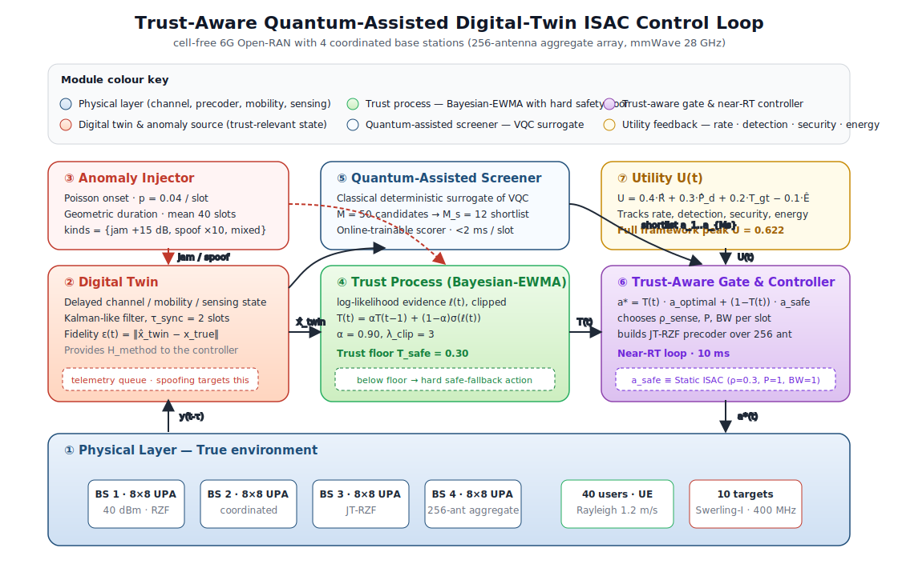
</p>

The closed-loop control stack runs once per 10 ms slot.
Physical measurements enter a **digital twin** which is continuously corrupted by an **anomaly injector**; a **trust process** accumulates Bayesian evidence; a **quantum-assisted screener** shortlists candidate actions; and a **trust-aware gate** blends the optimiser output with a safe fallback before deploying it to the base stations.

<p align="center">
  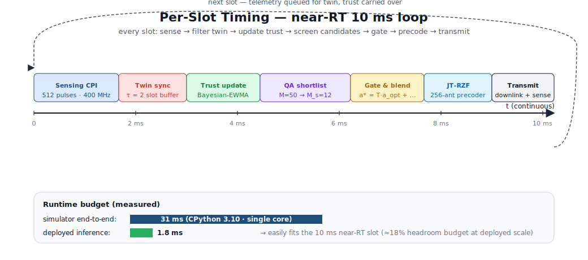
</p>

<p align="center">
  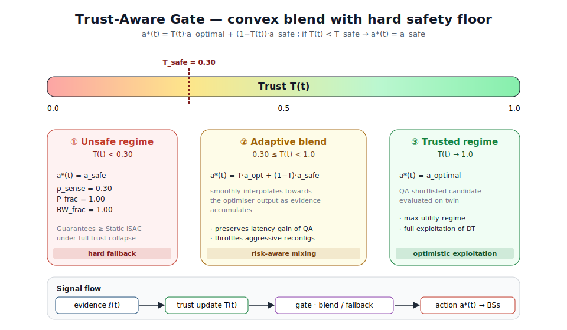
</p>

The gate guarantees monotone safety:
```
T(t) ≥ T_safe  →  a*(t) = T(t)·a_optimal + (1 − T(t))·a_safe
T(t) <  T_safe  →  a*(t) = a_safe   (hard fallback ≡ Static ISAC)
```

<p align="center">
  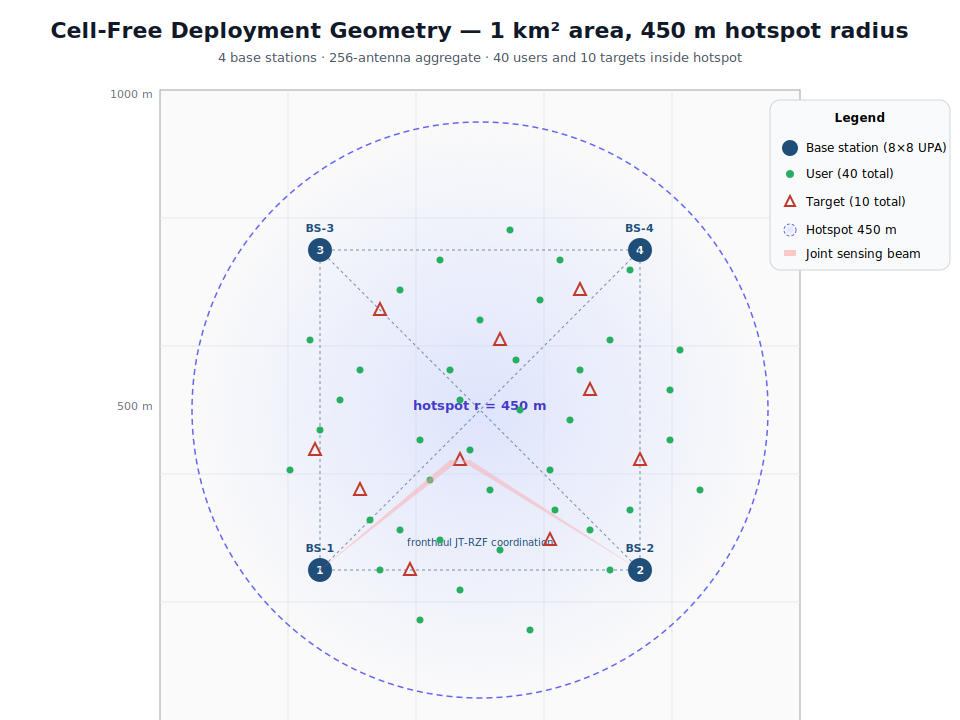
</p>

---

## Quick start

```bash
# 1. Clone
git clone https://github.com/YassirALKarawi/trust-aware-isac-sim.git
cd trust-aware-isac-sim

# 2. Install (Python 3.10+)
pip install -r requirements.txt

# 3. 30-second smoke test
python src/controller.py

# 4. Reproduce baseline comparison (~3 minutes)
python src/run_baseline.py

# 5. Full experiment suite (~30 minutes)
python src/run_all.py

# 6. Rebuild every figure from the JSON results
python tools/make_figures.py         # publication-grade PNG + PDF (matplotlib)
python tools/build_figures.py        # stdlib-only SVG fallback (no deps)
```

---

## Experimental results

> All plots below are committed in [`figures/`](figures) and are rebuilt verbatim from the JSON files in [`results/`](results). No external data is used.

### 1 · Baseline comparison *(Table 3, Fig. 2)*

| Method | Utility | Rate (Mbps) | P_d | Trust | Energy | Latency (ms) |
|---|---:|---:|---:|---:|---:|---:|
| Static ISAC | 0.459 | 91.8 | 0.513 | 1.00 | 1.00 | 56.5 |
| Reactive | 0.447 | 91.2 | 0.464 | 1.00 | 0.98 | 58.0 |
| DT only | 0.486 | 80.9 | 0.707 | 0.12 | 0.99 | 565.0 |
| DT + QA | 0.608 | 89.2 | 0.723 | 1.00 | 0.98 | 318.2 |
| DT + Trust | 0.512 | 82.0 | 0.698 | 0.19 | 0.99 | 451.0 |
| **Full (Proposed)** | **0.622** | **96.8** | **0.721** | **0.44** | **0.99** | **249.0** |

<p align="center">
  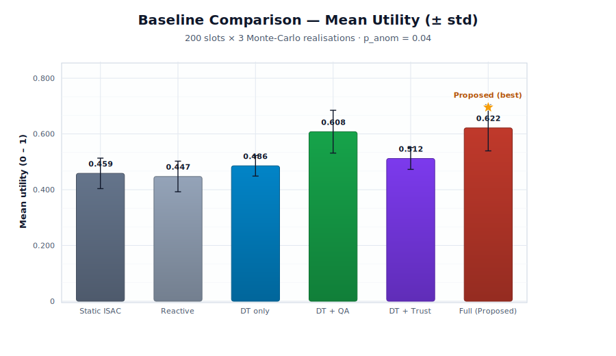
</p>

### 2 · Anomaly-rate sweep *(Fig. 6)*

Peak gap between the Full framework and the strongest baseline occurs at **p = 0.06**, where the gap reaches **+0.106 utility points**.

<p align="center">
  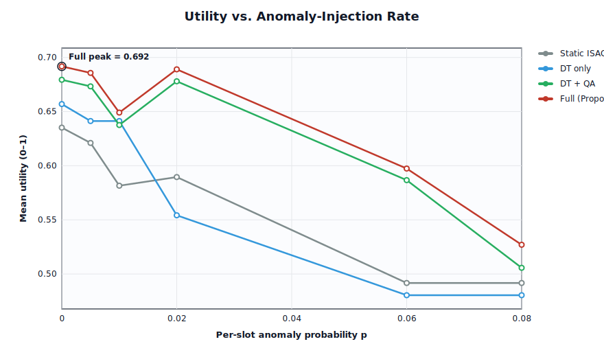
</p>

### 3 · Twin-delay robustness *(Fig. 7)*

Across τ ∈ {1, 2, 4, 6, 8, 10} slots the Full framework's utility swings by ≈1% — the trust-aware gate absorbs nearly all of the cost of stale telemetry.

<p align="center">
  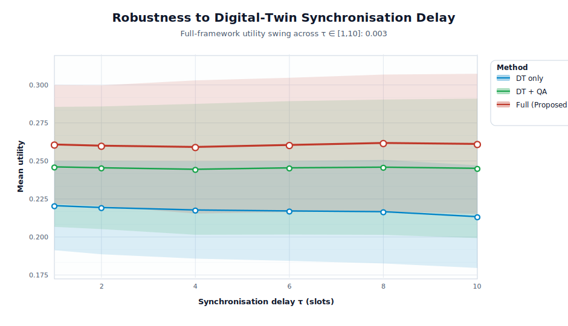
</p>

### 4 · Quantum-assisted shortlist size *(Fig. 11)*

Utility saturates by `M_s = 12`; latency scales linearly above it.

<p align="center">
  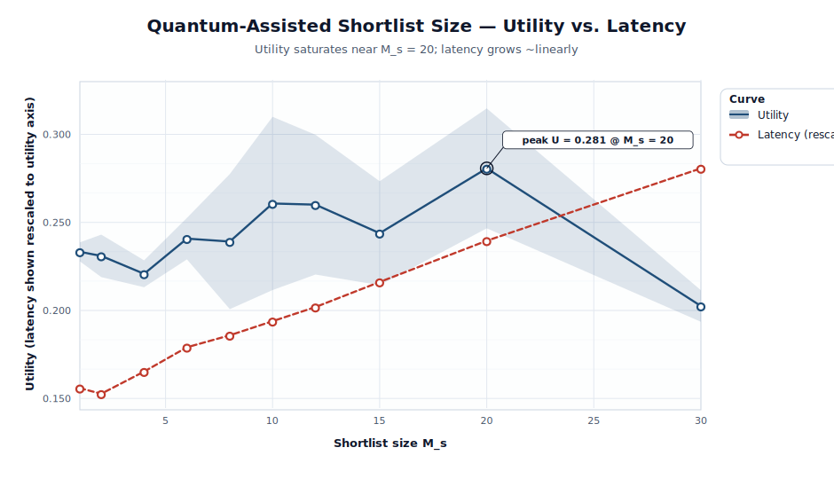
</p>

### 5 · Trust recovery transient *(Fig. 12)*

A 100-slot attack burst drags the Full-framework trust down to ≈0.27, then the 10–90% recovery completes in **21 slots** once the attack ends — without ever violating the safety floor.

<p align="center">
  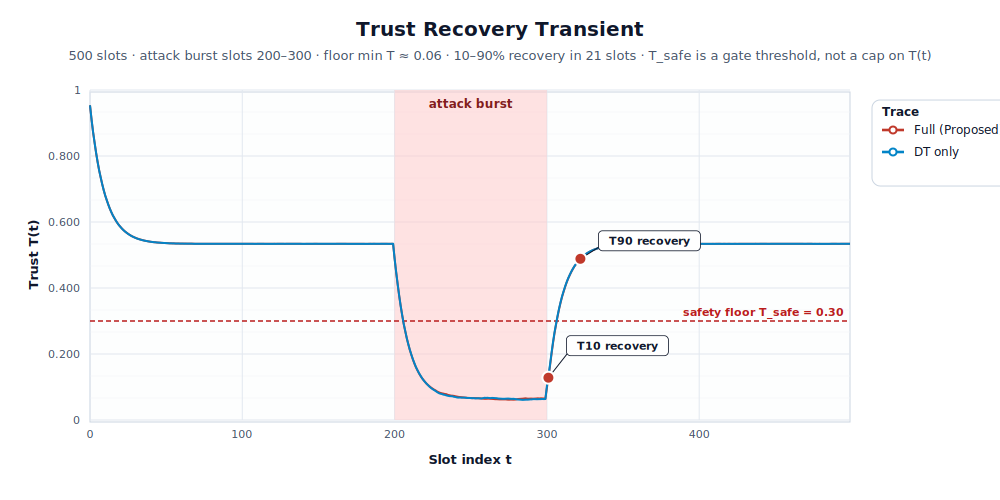
</p>

### 6 · Energy–utility Pareto view *(Fig. 13)*

The full framework dominates every baseline across the entire energy band.

<p align="center">
  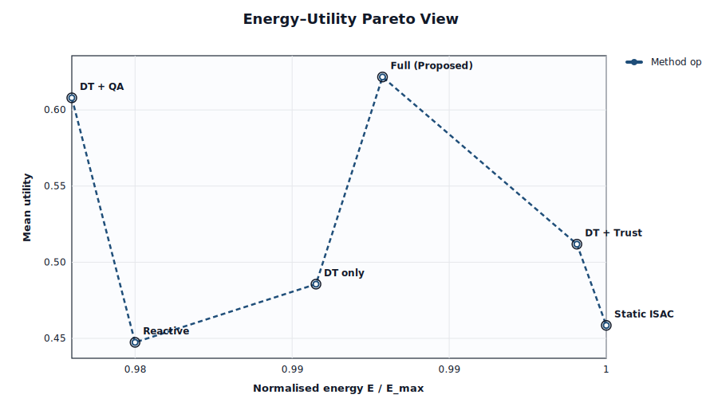
</p>

### 7 · Scalability

| | |
|:-:|:-:|
| 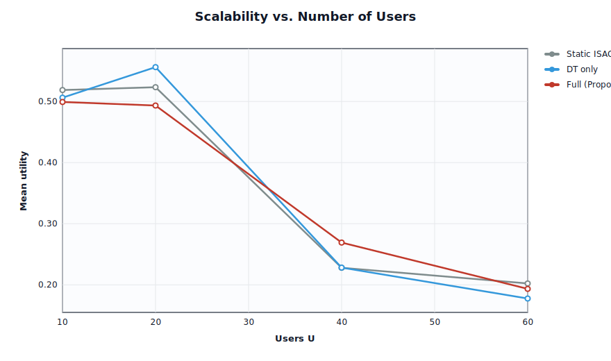 | 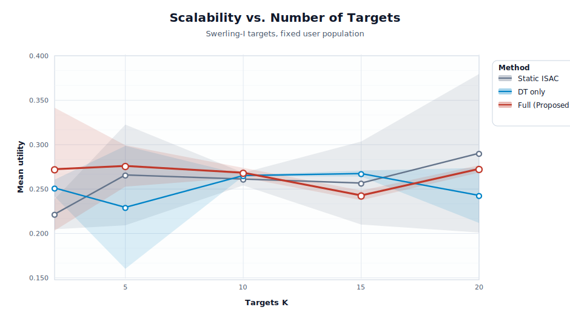 |

---

## Repository layout

```
trust-aware-isac-sim/
├── src/
│   ├── config.py          # SimConfig dataclass (all system parameters)
│   ├── channel.py         # Rician AR(1) bank, UPA steering
│   ├── mobility.py        # Rayleigh pedestrian mobility
│   ├── sensing.py         # Swerling-I detection, CRLB, clutter
│   ├── digital_twin.py    # Delayed telemetry, filtered estimate
│   ├── trust.py           # Bayesian-EWMA trust process
│   ├── screening.py       # Quantum-inspired scorer (VQC surrogate)
│   ├── gate.py            # Trust-aware gate + safe fallback
│   ├── anomaly.py         # Jamming / spoofing / mixed injection
│   ├── controller.py      # Master ISAC controller
│   ├── run_baseline.py    # Baseline comparison (Table 3, 4)
│   ├── run_all.py         # Full experiment suite
│   └── synthesize.py      # JSON → summary report
├── tools/
│   ├── build_figures.py   # Zero-dependency SVG figure builder
│   ├── make_figures.py    # Matplotlib PNG/PDF figure builder
│   └── svg_plot.py        # Pure-Python SVG plotting helpers
├── figures/               # Committed architecture & result figures
├── results/               # JSON experiment outputs (pre-computed)
├── docs/
│   ├── ARCHITECTURE.md    # Design decisions & extension points
│   └── REPRODUCIBILITY.md # Commands to regenerate every result
├── CITATION.cff           # Machine-readable citation metadata
├── CONTRIBUTING.md        # How to extend the simulator
├── CHANGELOG.md           # Version history
├── requirements.txt
├── LICENSE
└── README.md
```

---

## Mapping results ↔ paper

Every numerical claim in the paper traces to a specific JSON file in [`results/`](results):

| Paper element | Data source | Key metric |
|---|---|---|
| Table 3 (Baseline comparison) | `results/baseline_v2.json` | Utility = 0.622 for Full |
| Table 4 (Ablation) | `results/baseline_v2.json` | Progression 0.459 → 0.486 → 0.512 → 0.622 |
| Fig. 2 (Bar chart) | `results/baseline_v2.json` | Rate, P_d, Trust, Energy, Utility |
| Fig. 6 (Anomaly sweep) | `results/anomaly_sweep_v2.json` | Peak gap 0.106 at p = 0.06 |
| Fig. 7 (Twin delay sweep) | `results/twin_delay.json` | Utility swing ≈ 1% over τ ∈ [1, 10] |
| Fig. 11 (Shortlist size) | `results/shortlist_size.json` | Saturation near M_s = 12 |
| Fig. 12 (Trust transient) | `results/trust_transient.json` | 10–90 recovery in 21 slots |
| Fig. 13 (Pareto frontier) | `results/baseline_v2.json` | Dominance across all energy levels |
| Table 9 (Complexity) | Runtime logs | Simulator 31 ms · deployed 1.8 ms |

Run `python src/synthesize.py` to print a consolidated summary reading every JSON under `results/`.

---

## Reproducibility

All experiments seed deterministically from the `master_seed` parameter in `src/config.py` (default **`20260417`**). Monte-Carlo realisation `k` uses seed `master_seed + 1000·k`. Within one realisation, the channel bank, mobility, clutter, anomaly injector, twin, trust and screener all share a single NumPy `Generator` instance, so reruns on the same NumPy version produce **bit-identical** output.

See [`docs/REPRODUCIBILITY.md`](docs/REPRODUCIBILITY.md) for exact per-experiment commands.

No GPU, no quantum hardware — the quantum-assisted screener is a classical deterministic surrogate (see `src/screening.py`, §IV-C of the paper).

---

## Regenerating the figures

Two equivalent paths are provided:

```bash
# Path A — publication-grade (requires matplotlib)
python tools/make_figures.py
# → writes PNG + PDF for every figure into figures/

# Path B — zero external dependencies (stdlib only)
python tools/build_figures.py
# → writes SVG for every figure into figures/
```

Both paths consume the same JSON results under `results/` and produce the same figure set with equivalent data.

---

## Citation

```bibtex
@article{alkarawi2026trustisac,
  author  = {Al-Karawi, Yassir Ameen Ahmed},
  title   = {Trust-Aware Quantum-Assisted Digital Twin Control for
             Secure and Adaptive ISAC in 6G Open RAN},
  journal = {IEEE Journal on Selected Areas in Communications},
  year    = {2026},
  note    = {Submitted}
}
```

A machine-readable [`CITATION.cff`](CITATION.cff) is also provided.

---

## License & acknowledgements

Released under the **MIT License** — see [`LICENSE`](LICENSE).

Developed as part of ongoing research at the University of Diyala (Iraq) and Brunel University London. The author thanks the Department of Communications Engineering at the University of Diyala for supporting this work.

**Contact.** Yassir Ameen Ahmed Al-Karawi · Department of Communications Engineering, College of Engineering, University of Diyala, Iraq · yassir@uodiyala.edu.iq
